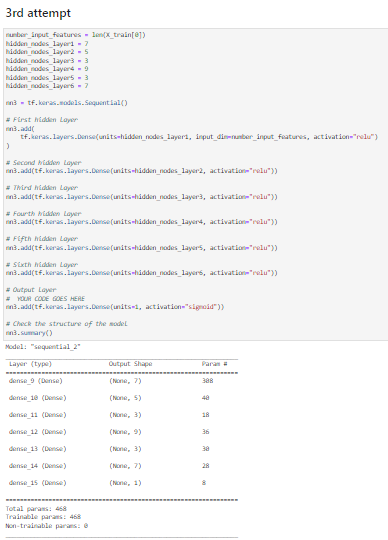

# Neural_Network_Charity_Analysis

## Overview

The purpose of analysis is to predict Alphabet Soup's suceessful investment utilizing their historical investment data. 

The goal of analysis is to develop models for Alphabet Soup and help make best prediciton on investment decision on the organization to predict their likelihood of success at least 75% of time. 

The investment data set contains following information on  organization Alphabet Soup has made investments: 

* **EIN and NAME**  —Identification columns
* **APPLICATION_TYPE** —Alphabet Soup application type
* **AFFILIATION** —Affiliated sector of industry
* **CLASSIFICATION** —Government organization classification
* **USE_CASE** — Use case for funding
* **ORGANIZATION** —Organization type
* **STATUS** —Active status
* **INCOME_AMT** —Income classification
* **SPECIAL_CONSIDERATIONS** —Special consideration for application
* **ASK_AMT** —Funding amount requested
* **IS_SUCCESSFUL** —Was the money used effectively

## Results

The metadata was preprocessed and transformed prior to Modelling. 

### Data Preprocessing

* The goal of the model is to predict if the investment provided was utilized successfully.The **IS_SUCCESSFUL** column stores that information hence should be assigned to be target for the model. 

* The data on about  **APPLICATION_TYPE**,  **AFFILIATION**, **CLASSIFICATION**, **USE_CASE**, **ORGANIZATION**, **STATUS**, **INCOME_AMT**, **SPECIAL_CONSIDERATIONS**,  **ASK_AMT** were used to predict investment success outcome, hence should be assigned to be features for the model. 

* The Identification data **EIN** and **NAME** will not be useful in developing Model and hence considered neither targets nor features. Therefore those are dropped. 

The catagorical variables  **APPLICATION_TYPE** and  **CLASSIFICATION** has more than 10 unique values values. The  **APPLICATION_TYPE** was binned into other group if the population is less than 500 and **CLASSIFICATION*   binned into other group if the population is less than 1800.  OneHotEncoder instance was used to tranform all the catagorical variables and include it as a feature to train the model. Then StandardScaler was used to standardize numerical variables and reduce the overall likelihood of outliers for training the model.

### Compiling, Training, and Evaluating the Model

- There are are 43 different inputs, hence if we follow the good rule of thumb for basic neural network model (*two to three times the amount of neurons in the hidden layer as the number of inputs*) we will need to add 129 neurons on the hidden layer. While this may still yield good result in our case, the deep neural network will be more robust and have ability to identify complex nonlinear relationships efficiently. Additionally on deep neural network, there is a distributed effort to find optimal weights—faster and each neuron can focus on different features to identify nonlinear effects—smarter. Hence it was decided to use deep neural network model with additional hidden layer in the model. With the additional hidden layer the model should be able to perform well with fewer neurons. On 1st hidden layer 8 neurons were used and on 2nd hidden layer 6 neurons were used. The number of neurons were chosen aribitarily as there is no formula to pick ideal number of neurons or hidden layers. Hence, modeller need to try with with random numbers of neurons and hidden layers until optimal result is produced.

- The tanh activation function is used for hidden layers as it is ideal for both classification or regression, and it expands the range between -1 and 1.

- Sigmoid activation function is used to produce probability output for the classification output.

- The model accuracy is 0.7267 or ~72.67% is lower than targeted 75% accuracy for model performance. 
 

Addtional 3 attempts we made to tweak the model in anticipation of better result. 

On the **1st attempt**, 3 hidden layers with relu activation functions were created. The hidden layers were assigned  8, 6 and 3 neurons respectively.   

- The model accuracy is  0.7254 or ~72.54%, still lower than targeted 75% accuracy for model performance. 

On the **2nd attempt**, 4 hidden layers with tanh activation functions were created. The hidden layers were assigned 9,84 and 5 neurons respectively.   

- The model accuracy is 0.7236 or ~72.36%, still lower than targeted 75% accuracy for model performance. 

On the **3rd attempt**, 6 hidden layers with relu activation functions were created. The hidden layers were assigned 7,5,3 9,3 and 7 neurons respectively.   

- The model accuracy is 0.7250  or ~72.50%, still lower than targeted 75% accuracy for model performance. 

 

## Summary 

All 4 models with various number of hidden layers, neurons and activation functions resulted slightly different accuracy within the range of ~72.36% to 72.87%

| Model Name   | # of Hidden Layers  | Activation Function|Neurons | Output function| Performance Result|
| ----------- | ----------- |----------- |----------- |----------- |----------- |
| **Initial**   |    2     |  tanh |   8,6        |    Sigmoid |   72.67%       
| Attempt 1         |   3         |  relu |   8,6,3        |    Sigmoid |   72.54%       |
| Attempt 2        |   4         |  tanh |   9,8,4,5        |    Sigmoid | 72.36%      |
| Attempt 3      |   6      |  relu |   7,5,3,9,3,7      |    Sigmoid |   72.50%       |

In this particular excercise the accuracy did not improve significantly. Nonetheless all 4 models were able to predict successful investment accurately more than 72% of time. 

Model with relu activation function persistently perdicted at ~72.5% of time. The tanh function performed better with 2  hidden layers than 6 hidden layer. The model **Initial** produced the best result and is recommended to use in predicting success of future investments.  